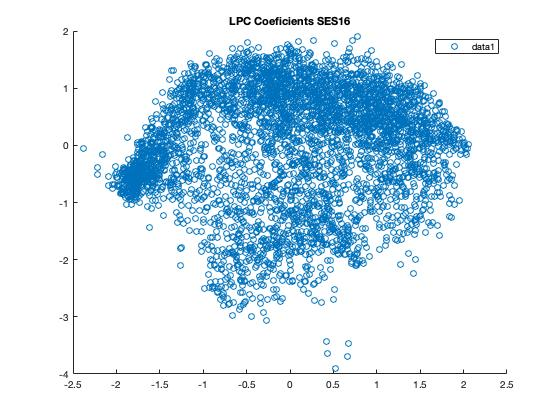
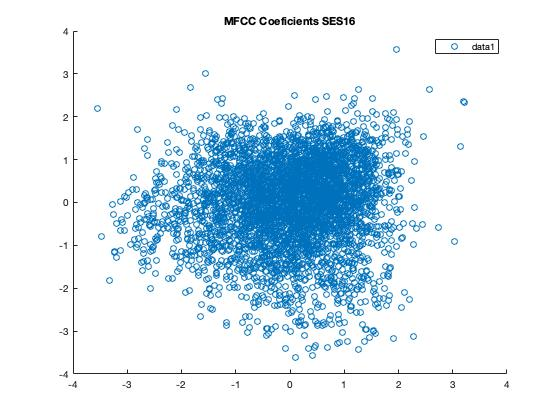

PAV - P4: reconocimiento y verificación del locutor
===================================================

Obtenga su copia del repositorio de la práctica accediendo a [Práctica 4](https://github.com/albino-pav/P4)
y pulsando sobre el botón `Fork` situado en la esquina superior derecha. A continuación, siga las
instrucciones de la [Práctica 2](https://github.com/albino-pav/P2) para crear una rama con el apellido de
los integrantes del grupo de prácticas, dar de alta al resto de integrantes como colaboradores del proyecto
y crear la copias locales del repositorio.

También debe descomprimir, en el directorio `PAV/P4`, el fichero [db_8mu.tgz](https://atenea.upc.edu/pluginfile.php/3145524/mod_assign/introattachment/0/spk_8mu.tgz?forcedownload=1)
con la base de datos oral que se utilizará en la parte experimental de la práctica.

Como entrega deberá realizar un *pull request* con el contenido de su copia del repositorio. Recuerde
que los ficheros entregados deberán estar en condiciones de ser ejecutados con sólo ejecutar:

~~~~~~~~~~~~~~~~~~~~~~~~~~~~~~~~~~~~~~~~~~~~~~~~~~~~~.sh
  make release
  run_spkid mfcc train test classerr verify verifyerr
~~~~~~~~~~~~~~~~~~~~~~~~~~~~~~~~~~~~~~~~~~~~~~~~~~~~~

Recuerde que, además de los trabajos indicados en esta parte básica, también deberá realizar un proyecto
de ampliación, del cual deberá subir una memoria explicativa a Atenea y los ficheros correspondientes al
repositorio de la práctica.

A modo de memoria de la parte básica, complete, en este mismo documento y usando el formato *markdown*, los
ejercicios indicados.

## Ejercicios.

### SPTK, Sox y los scripts de extracción de características.

- Analice el script `wav2lp.sh` y explique la misión de los distintos comandos, y sus opciones, involucrados
  en el *pipeline* principal (`sox`, `$X2X`, `$FRAME`, `$WINDOW` y `$LPC`).

Todas las señales y ficheros que SPTK es capaz de leer tienen el mismo formato: sucesión de reales en coma flotante de 32 bits
(float en C), sin ningún tipo de cabecera o formato adicional. El programa sox se usa para para generar una señal con el
formato adecuado para SPTK a partir de una señal con otro formato (WAVE). Si indicamos como fichero de salida un guion (-)
hacemos que sox escriba la salida en estándar.

X2X es el programa de SPTK que permite la conversión entre distintos formatos de datos, no permite leer ficheros con formato
WAVE (solo raw).

Frame se usa para separar la señal de entrada en tramas de M muestras con desplazamiento de R muestras.

Window multiplica cada trama por la ventana de Blackman.

Lpc calcula los lpc_order primeros coeficientes de predicción lineal, predichos por el factor de ganancia del predictor.

- Explique el procedimiento seguido para obtener un fichero de formato *fmatrix* a partir de los ficheros
  de salida de SPTK (líneas 41 a 47 del script `wav2lp.sh`).
  
      # Main command for feature extration
      sox $inputfile -t raw -e signed -b 16 - | $X2X +sf | $FRAME -l 240 -p 80 | $WINDOW -l 240 -L 240 |
      $LPC -l 240 -m $lpc_order > $base.lp
      
      # Our array files need a header with the number of cols and rows:
      ncol=$((lpc_order+1)) # lpc p =>  (gain a1 a2 ... ap) 
      nrow=`$X2X +fa < $base.lp | wc -l | perl -ne 'print $_/'$ncol', "\n";'`
  
Basándonos en las explicaciones del apartado anterior, podemos entender como se gestionan los datos en este comando. Sox
convierte la señal de raw al formato que queremos, (-e) nos indica signed y (-b) codifica en 16 bits. En FRAME, divide la
señal de entrada en tramas de 240 muestras con desplazamientos de ventana de 80 muestras. Window multiplica por la ventana de
Blackman y LPC calcula los coeficientes del LPC. Finalmente el resultado se almacena en $base.lp

En las 2 últimas líneas se define la matriz donde se van a almacenar los datos. Cada fila se corresponde a una trama de la señal y cada columna a cada uno de los coeficientes en los que se parametriza la trama.

  * ¿Por qué es conveniente usar este formato (u otro parecido)?

Este formato nos ayuda a tener todos los coeficientes juntos, ordenados y separados por tramas, y esto nos ayuda mucho a manejar los datos para cualquier tipo de operación, que sería mucho más compleja si tuviésemos los datos dispersos.

- Escriba el *pipeline* principal usado para calcular los coeficientes cepstrales de predicción lineal
  (LPCC) en su fichero <code>scripts/wav2lpcc.sh</code>:

      # Main command for feature extration
      sox $inputfile -t raw -e signed -b 16 - | $X2X +sf | $FRAME -l 240 -p 80 | $WINDOW -l 240 -L 240 |
	    $LPC -l 240 -m $lpc_order | $LPC2C -m $lpc_order -M $ceps_order > $base.lpcc
      
- Escriba el *pipeline* principal usado para calcular los coeficientes cepstrales en escala Mel (MFCC) en
  su fichero <code>scripts/wav2mfcc.sh</code>:
  
    

      # Main command for feature extration
      # -s 8 ponemos la frecuencia de muestreo a 8kHz
      sox $inputfile -t raw -e signed -b 16 - | $X2X +sf | $FRAME -l 240 -p 80 | $WINDOW -l 240 -L 240 |
	    $MFCC -l 240 -m $mfcc_order -n $num_filters -s 8 > $base.mfcc

### Extracción de características.

- Inserte una imagen mostrando la dependencia entre los coeficientes 2 y 3 de las tres parametrizaciones
  para una señal de prueba.
  
    
      
    
      
    
      
    
      
    
      
    

  + ¿Cuál de ellas le parece que contiene más información?
  
La parametrización que contenga más información es aquella que tenga los coeficientes más incorrelados. Gráficamente, sabemos
que cuanto más dispersos se encuentren los puntos en las gráficas más incorrelación, por tanto, aquella que tenga los puntos
más dispersos será la que contenga más información. En este caso, vemos como la predicción lineal sola tiende a acumularse
mientras que LPC y MFCC están más dispersos. MFCC es el que tiene más incorrelación de todos, ya que, como vemos los puntos se
ordenan casi en un cuadrado.

- Usando el programa <code>pearson</code>, obtenga los coeficientes de correlación normalizada entre los
  parámetros 2 y 3, y rellene la tabla siguiente con los valores obtenidos.
  
  pearson work/lp/BLOCK01/SES016/*.lp
  
  pearson work/lpcc/BLOCK01/SES016/*.lpcc
     
  pearson work/mfcc/BLOCK01/SES016/*.mfcc

  |                        | **LP**   | **LPCC** | **MFCC** |
  |------------------------|:--------:|:--------:|:--------:|
  | &rho;x[2,3] |  -0,727  |  0,488   |  0,1469  |
  
  + Compare los resultados de <code>pearson</code> con los obtenidos gráficamente.
  
  Cuanto mayor sea el coeficiente rho, mayor correlación habrá entre las muestras, y cuanto menor, menor correlación. Por eso,
  viendo los resultados, vemos que realmente, el MFCC es el más pequeño, por tanto, es el que realmente más información
  aporta, que es más o menos lo que observamos en las gráficas. 
  
- Según la teoría, ¿qué parámetros considera adecuados para el cálculo de los coeficientes LPCC y MFCC?

Según la teoría, el número de filtros para el MFCC varía entre 24 -40 (M) y el número de coeficientes suele ser 13 (Q). Para
el LPCC también se pueden usar 13 coeficientes (Q), nosotros hemos puesto 14 en LPC porque nos daba buen resultado y el número
de filtros de MFCC lo hemos puesto a 40, mientras que los coeficientes del MFCC los hemos dejado a 13.

### Entrenamiento y visualización de los GMM.

Complete el código necesario para entrenar modelos GMM.

- Inserte una gráfica que muestre la función de densidad de probabilidad modelada por el GMM de un locutor
  para sus dos primeros coeficientes de MFCC.
  
  
        
- Inserte una gráfica que permita comparar los modelos y poblaciones de dos locutores distintos (la gŕafica
  de la página 20 del enunciado puede servirle de referencia del resultado deseado). Analice la capacidad
  del modelado GMM para diferenciar las señales de uno y otro.
  

          

          
En las imágenes anteriores estamos observando las predicciones hechas sobre 2 locutores distintos, con unos coeficientes
distintos. Cada locutor tiene una GMM distinta, ya que las características MFCC de estos son también diferentes.

### Reconocimiento del locutor.

Complete el código necesario para realizar reconociminto del locutor y optimice sus parámetros.

- Inserte una tabla con la tasa de error obtenida en el reconocimiento de los locutores de la base de datos
  SPEECON usando su mejor sistema de reconocimiento para los parámetros LP, LPCC y MFCC.
  
  |     **Método**     | **nerr**   | **ntot** | **error_rate** |
  |--------------------|:----------:|:--------:|:--------------:|
  | **LP**             |     64     |   785    |     8,15%      | 
  | **LPCC**           |     10     |   785    |     1,27%      | 
  | **MFCC**           |     58     |   785    |     7,39%      | 
  
  Los parámetros usados para la obtención de estos resultados son:
  
    - LP: 15 coeficientes
  
    - LPCC: 14 coeficientes, orden de LP = 14.
  
    - MFCC: 13 coeficientes y 40 filtros
  
    - GMM Threshold = 0,0001
  
    - GMM nº de iteraciones = 40
  
    - GMM nº de gaussianas = 100
  

### Verificación del locutor.

Complete el código necesario para realizar verificación del locutor y optimice sus parámetros.

- Inserte una tabla con el *score* obtenido con su mejor sistema de verificación del locutor en la tarea
  de verificación de SPEECON. La tabla debe incluir el umbral óptimo, el número de falsas alarmas y de
  pérdidas, y el score obtenido usando la parametrización que mejor resultado le hubiera dado en la tarea
  de reconocimiento.
  
  
  |                          |         **LP**          |      **LPCC**      |         **MFCC**          |
  |--------------------------|:-----------------------:|:------------------:|:-------------------------:|
  | **TH Umbral**            |     1,17                |   0,227            |     2,402                 | 
  | **Falsa Alarma**         |     0/1000 = 0          |   0/1000 = 0       |     0/1000 = 0            | 
  | **Pérdidas**             |     161/250 = 0,644     |   38/250 = 0,15    |     233/250 = 0,9320      | 
  | **Coste de detección**   |     64,4                |   15,2             |     93,2                  | 
 
 En el training se han utilizado los siguientes parámetros:
 
   - Th = 0,0001
   - 40 iteraciones
   - 80 Gaussianas

En el trainworld se han utilizado los siguientes parámetros:

  - Th = 0,0001
  - 50 iteraciones
  - 50 Gaussianas 

 
### Test final y trabajo de ampliación.

- Recuerde adjuntar los ficheros `class_test.log` y `verif_test.log` correspondientes a la evaluación
  *ciega* final.

- Recuerde, también, enviar a Atenea un fichero en formato zip o tgz con la memoria con el trabajo
  realizado como ampliación, así como los ficheros `class_ampl.log` y/o `verif_ampl.log`, obtenidos como
  resultado del mismo.

